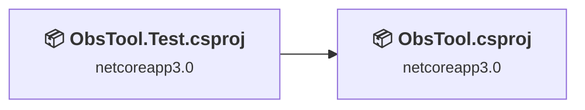
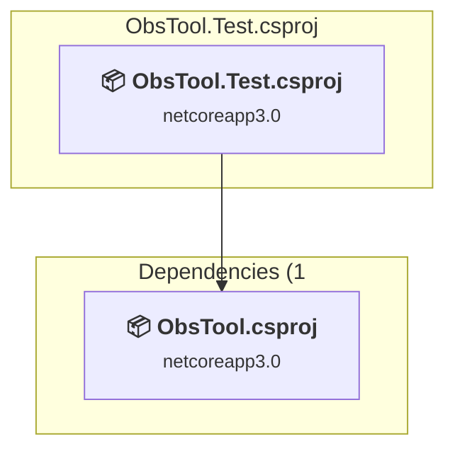
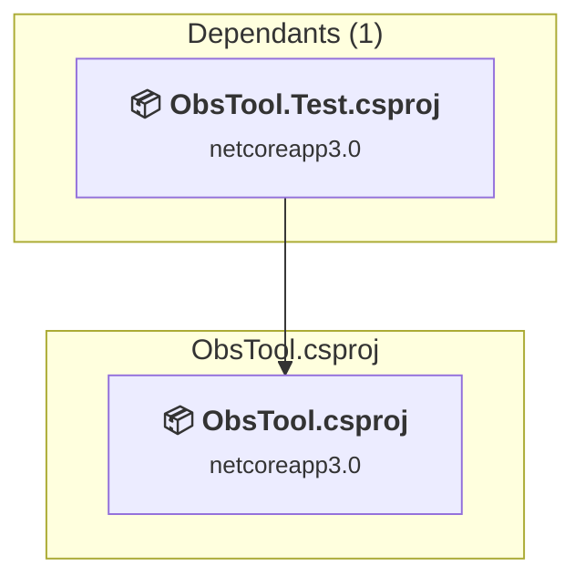

# Projects and dependencies analysis

This document provides a comprehensive overview of the projects and their dependencies in the context of upgrading to .NETCoreApp,Version=v10.0.

## Table of Contents

- [Executive Summary](#executive-Summary)
  - [Highlevel Metrics](#highlevel-metrics)
  - [Projects Compatibility](#projects-compatibility)
  - [Package Compatibility](#package-compatibility)
  - [API Compatibility](#api-compatibility)
- [Aggregate NuGet packages details](#aggregate-nuget-packages-details)
- [Top API Migration Challenges](#top-api-migration-challenges)
  - [Technologies and Features](#technologies-and-features)
  - [Most Frequent API Issues](#most-frequent-api-issues)
- [Projects Relationship Graph](#projects-relationship-graph)
- [Project Details](#project-details)

  - [ObsTool.Test\ObsTool.Test.csproj](#obstooltestobstooltestcsproj)
  - [ObsTool\ObsTool.csproj](#obstoolobstoolcsproj)

## Executive Summary

### Highlevel Metrics

| Metric | Count | Status |
| :--- | :---: | :--- |
| Total Projects | 2 | All require upgrade |
| Total NuGet Packages | 11 | 4 need upgrade |
| Total Code Files | 61 |  |
| Total Code Files with Incidents | 4 |  |
| Total Lines of Code | 4096 |  |
| Total Number of Issues | 24 |  |
| Estimated LOC to modify | 17+ | at least 0.4% of codebase |

### Projects Compatibility

| Project | Target Framework | Difficulty | Package Issues | API Issues | Est. LOC Impact | Description |
| :--- | :---: | :---: | :---: | :---: | :---: | :--- |
| [ObsTool.Test\ObsTool.Test.csproj](#obstooltestobstooltestcsproj) | netcoreapp3.0 | 🟢 Low | 0 | 0 |  | DotNetCoreApp, Sdk Style = True |
| [ObsTool\ObsTool.csproj](#obstoolobstoolcsproj) | netcoreapp3.0 | 🟢 Low | 5 | 17 | 17+ | AspNetCore, Sdk Style = True |

### Package Compatibility

| Status | Count | Percentage |
| :--- | :---: | :---: |
| ✅ Compatible | 7 | 63.6% |
| ⚠️ Incompatible | 0 | 0.0% |
| 🔄 Upgrade Recommended | 4 | 36.4% |
| ***Total NuGet Packages*** | ***11*** | ***100%*** |

### API Compatibility

| Category | Count | Impact |
| :--- | :---: | :--- |
| 🔴 Binary Incompatible | 2 | High - Require code changes |
| 🟡 Source Incompatible | 15 | Medium - Needs re-compilation and potential conflicting API error fixing |
| 🔵 Behavioral change | 0 | Low - Behavioral changes that may require testing at runtime |
| ✅ Compatible | 4055 |  |
| ***Total APIs Analyzed*** | ***4072*** |  |

## Aggregate NuGet packages details

| Package | Current Version | Suggested Version | Projects | Description |
| :--- | :---: | :---: | :--- | :--- |
| AutoMapper | 9.0.0 | 16.1.1 | [ObsTool.csproj](#obstoolobstoolcsproj) | NuGet package contains security vulnerability |
| AutoMapper.Extensions.Microsoft.DependencyInjection | 7.0.0 |  | [ObsTool.csproj](#obstoolobstoolcsproj) | ✅Compatible |
| Microsoft.AspNetCore.SpaServices.Extensions | 3.0.0 | 10.0.6 | [ObsTool.csproj](#obstoolobstoolcsproj) | NuGet package upgrade is recommended |
| Microsoft.EntityFrameworkCore.Sqlite | 3.0.0 | 10.0.6 | [ObsTool.csproj](#obstoolobstoolcsproj) | NuGet package upgrade is recommended |
| Microsoft.NET.Test.Sdk | 16.4.0 |  | [ObsTool.Test.csproj](#obstooltestobstooltestcsproj) | ✅Compatible |
| Microsoft.VisualStudio.Web.CodeGeneration.Design | 3.0.0 | 10.0.2 | [ObsTool.csproj](#obstoolobstoolcsproj) | NuGet package upgrade is recommended |
| moq | 4.13.1 |  | [ObsTool.csproj](#obstoolobstoolcsproj) | ✅Compatible |
| NLog | 4.6.8 |  | [ObsTool.csproj](#obstoolobstoolcsproj) | ✅Compatible |
| Nlog.Web.AspNetCore | 4.9.0 |  | [ObsTool.csproj](#obstoolobstoolcsproj) | ✅Compatible |
| NUnit | 3.12.0 |  | [ObsTool.Test.csproj](#obstooltestobstooltestcsproj) | ✅Compatible |
| NUnit3TestAdapter | 3.15.1 |  | [ObsTool.Test.csproj](#obstooltestobstooltestcsproj) | ✅Compatible |

## Top API Migration Challenges

### Technologies and Features

| Technology | Issues | Percentage | Migration Path |
| :--- | :---: | :---: | :--- |

### Most Frequent API Issues

| API | Count | Percentage | Category |
| :--- | :---: | :---: | :--- |
| M:Microsoft.Extensions.Configuration.ConfigurationBinder.Get''1(Microsoft.Extensions.Configuration.IConfiguration) | 2 | 11.8% | Binary Incompatible |
| T:Microsoft.Extensions.DependencyInjection.SpaStaticFilesExtensions | 2 | 11.8% | Source Incompatible |
| T:Microsoft.AspNetCore.Mvc.CompatibilityVersion | 2 | 11.8% | Source Incompatible |
| T:Microsoft.AspNetCore.SpaServices.SpaOptions | 1 | 5.9% | Source Incompatible |
| P:Microsoft.AspNetCore.SpaServices.ISpaBuilder.Options | 1 | 5.9% | Source Incompatible |
| P:Microsoft.AspNetCore.SpaServices.SpaOptions.SourcePath | 1 | 5.9% | Source Incompatible |
| T:Microsoft.AspNetCore.Builder.SpaApplicationBuilderExtensions | 1 | 5.9% | Source Incompatible |
| M:Microsoft.AspNetCore.Builder.SpaApplicationBuilderExtensions.UseSpa(Microsoft.AspNetCore.Builder.IApplicationBuilder,System.Action{Microsoft.AspNetCore.SpaServices.ISpaBuilder}) | 1 | 5.9% | Source Incompatible |
| M:Microsoft.Extensions.DependencyInjection.SpaStaticFilesExtensions.UseSpaStaticFiles(Microsoft.AspNetCore.Builder.IApplicationBuilder) | 1 | 5.9% | Source Incompatible |
| P:Microsoft.AspNetCore.SpaServices.StaticFiles.SpaStaticFilesOptions.RootPath | 1 | 5.9% | Source Incompatible |
| M:Microsoft.Extensions.DependencyInjection.SpaStaticFilesExtensions.AddSpaStaticFiles(Microsoft.Extensions.DependencyInjection.IServiceCollection,System.Action{Microsoft.AspNetCore.SpaServices.StaticFiles.SpaStaticFilesOptions}) | 1 | 5.9% | Source Incompatible |
| M:System.TimeSpan.FromMinutes(System.Double) | 1 | 5.9% | Source Incompatible |
| F:Microsoft.AspNetCore.Mvc.CompatibilityVersion.Version_3_0 | 1 | 5.9% | Source Incompatible |
| M:Microsoft.Extensions.DependencyInjection.MvcCoreMvcBuilderExtensions.SetCompatibilityVersion(Microsoft.Extensions.DependencyInjection.IMvcBuilder,Microsoft.AspNetCore.Mvc.CompatibilityVersion) | 1 | 5.9% | Source Incompatible |

## Projects Relationship Graph

Legend:
📦 SDK-style project
⚙️ Classic project

## Project Details

### ObsTool.Test\ObsTool.Test.csproj

#### Project Info

- **Current Target Framework:** netcoreapp3.0
- **Proposed Target Framework:** net10.0
- **SDK-style**: True
- **Project Kind:** DotNetCoreApp
- **Dependencies**: 1
- **Dependants**: 0
- **Number of Files**: 9
- **Number of Files with Incidents**: 1
- **Lines of Code**: 248
- **Estimated LOC to modify**: 0+ (at least 0.0% of the project)

#### Dependency Graph

Legend:
📦 SDK-style project
⚙️ Classic project

### API Compatibility

| Category | Count | Impact |
| :--- | :---: | :--- |
| 🔴 Binary Incompatible | 0 | High - Require code changes |
| 🟡 Source Incompatible | 0 | Medium - Needs re-compilation and potential conflicting API error fixing |
| 🔵 Behavioral change | 0 | Low - Behavioral changes that may require testing at runtime |
| ✅ Compatible | 167 |  |
| ***Total APIs Analyzed*** | ***167*** |  |

### ObsTool\ObsTool.csproj

#### Project Info

- **Current Target Framework:** netcoreapp3.0
- **Proposed Target Framework:** net10.0
- **SDK-style**: True
- **Project Kind:** AspNetCore
- **Dependencies**: 0
- **Dependants**: 1
- **Number of Files**: 64
- **Number of Files with Incidents**: 3
- **Lines of Code**: 3848
- **Estimated LOC to modify**: 17+ (at least 0.4% of the project)

#### Dependency Graph

Legend:
📦 SDK-style project
⚙️ Classic project

### API Compatibility

| Category | Count | Impact |
| :--- | :---: | :--- |
| 🔴 Binary Incompatible | 2 | High - Require code changes |
| 🟡 Source Incompatible | 15 | Medium - Needs re-compilation and potential conflicting API error fixing |
| 🔵 Behavioral change | 0 | Low - Behavioral changes that may require testing at runtime |
| ✅ Compatible | 3888 |  |
| ***Total APIs Analyzed*** | ***3905*** |  |

